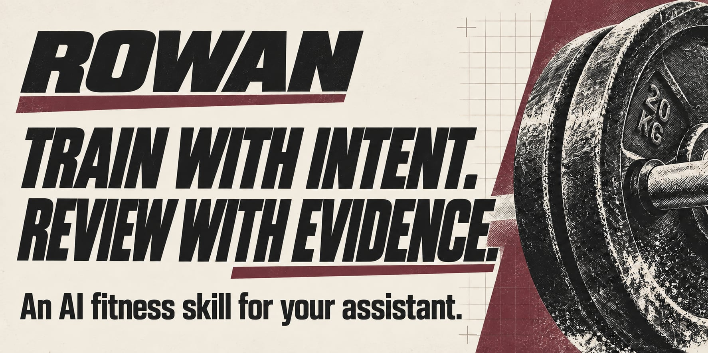

# Rowan Fitness Skill

Rowan is a free, open-source set of instructions you add to your AI assistant. Built for intermediate and advanced trainees, it brings lifting, cardio, nutrition and meal prep into one coaching conversation. Start with your program, equipment and goals; proposed changes get separate AI reviews.

**For new recommendations, use a session with separate reviewer tools.** Rowan checks your actual setup; ordinary chat can handle intake and logging. Your AI assistant's fees and usage limits apply. No GitHub account or coding is needed for the Claude upload.

[**Download skill ZIP**](https://github.com/MuscleOtter/rowan-fitness-skill/releases/latest/download/Rowan-Fitness-Skill.zip) · [Start in Claude](#start-in-claude) · [Other apps](#start-in-chatgpt-or-codex) · [FAQ](docs/FAQ.md)

## Start in Claude

1. **Download** the [skill ZIP](https://github.com/MuscleOtter/rowan-fitness-skill/releases/latest/download/Rowan-Fitness-Skill.zip). Leave it zipped.
2. **Upload and enable it:** **Customize → Skills → + → Create skill → Upload a skill**. [Claude's guide](https://support.claude.com/en/articles/12512180-use-skills-in-claude).
3. **Start Rowan.** Choose **Cowork** in the message box when available, then paste the prompt below. Cowork can provide separate reviewers; Rowan checks the tools in your actual session. [About Cowork](https://support.claude.com/en/articles/13345190-get-started-with-claude-cowork).

[Missing a button or stuck?](docs/SETUP.md#stuck-during-setup) Rowan can help organize your history while setup is incomplete.

## The starter prompt

> Use fitness-review-board. Start with my goals and the training I already do. Keep the technology simple. Ask only what you need next, preserve what works, and help me save my progress. Check which tools and reviewers are available here.

One recent workout note or screenshot is enough to begin. Rowan introduces himself first; you meet specialists when they help. No full gym inventory, spreadsheet or connected device is required to start.

## Built around your training

Explore lifting, cardio, food and everyday support

| What matters to you | What Rowan is designed to help with |
|---|---|
| Keep a program you like | Review actual sessions, progression and equipment before proposing changes. |
| Balance lifting and cardio | Assess HIIT, incline walking or other conditioning alongside workload, recovery and preferences. |
| Make nutrition practical | Review fueling, portions, hunger, dietary constraints and cutting strategies when relevant. |
| Get food onto the table | Develop recipes, meal prep and shopping lists with culinary and nutrition review. |
| Use the history you already have | Gather relevant authorized chats and available tracking data; accept rough notes when connections are unavailable. |
| Follow through | Choose useful check-ins, phone access or grocery support through available, authorized tools. |

A cut is one use case. You can also bring strength, muscle growth, conditioning, performance or consistency goals. Rowan asks what success means to **you**.

## What using Rowan looks like

Illustrative behavior from the instructions—not a live test or athlete result:

> **You:** “Log today's bench press: 185 lb for 8, 7 and 6 reps. I slept badly.”
>
> **Rowan:** “Recorded in this chat: bench press, 185 lb × 8/7/6; poor sleep. This hasn't been saved to your Training Record yet.”

A useful log can stay that brief. For a change, try: **“I like my lifting split. Review how cardio and meal prep fit around it.”** Rowan gathers the missing context and arranges the required reviews.

## A second look before a new recommendation

Rowan’s instructions require **three critique-and-rewrite passes**, followed by a separate check of the finished recommendation. If reviewers cannot run or material concerns remain, Rowan must hold the recommendation. [How the review works](docs/HOW-IT-WORKS.md#1-improve-advice-before-release).

These are AI roles, not credentialed human professionals. Their judgments are not measured success rates. [See the evidence and limits](docs/VALIDATION.md).

What a review is meant to catch

Fictional illustration of the rules; no reviewer execution or athlete result is claimed.

**Proposal:** replace a whole training block after one poor session.

**The critique should ask:** does the recent training history support that conclusion? What was planned versus completed, what changed, and which parts are still working?

**Required next step:** keep the replacement proposal pending while the missing context is gathered. Any revised recommendation still needs all required reviews. A confident explanation alone does not clear it.

Meet the review team

**Rowan** coordinates your coaching. **Mara** challenges the plan, **Quinn** checks evidence, **Ellis** checks data and **Kit** knows equipment. **Nico** reviews conditioning, **Sage** reviews nutrition and **Jules** handles recipes and meal prep. Required reviewers still participate even when only Rowan speaks to you.

## Progress you can carry with you

Your **Training Record** holds your goals, program, decisions and progress. Say **“Save my Training Record.”** Rowan verifies a save when possible, or prepares a download or complete text to carry into your next conversation. You do not need to edit its contents.

At check-ins, Rowan compares what happened with what was expected: keep useful tactics, investigate uncertain results and review changes. Upkeep runs when you return; background reminders and device access require separate, verified setup. [How it learns](docs/HOW-IT-WORKS.md) · [Connect your history and Apple Health](docs/SETUP.md#bring-your-history-together)

## Start in ChatGPT or Codex

**Codex:** ask “Install fitness-review-board from https://github.com/MuscleOtter/rowan-fitness-skill, then help me get started.” A session with the supported installer can handle the files and check review capabilities.

**ChatGPT:** [add the rule files to a Project](docs/SETUP.md#chatgpt-app). Naming Rowan alone does not install it. Intake and logging work with readable rules; new recommendations need independent review elsewhere.

**Claude Code:** follow the [folder-install instructions](docs/SETUP.md#claude-code).

### Get the folder

Use the [extraction instructions](docs/SETUP.md#get-the-folder) for local installs or ChatGPT uploads. Keep the ZIP intact for Claude's Skills upload.

## Help Rowan improve

Try it with your existing routine and tell us where it helps or creates friction. [Report an issue or suggest an improvement](https://github.com/MuscleOtter/rowan-fitness-skill/issues/new/choose) using a fictional or de-identified example; keep personal health records out of public issues.

[Share Rowan](docs/SHARE.md) · [FAQ](docs/FAQ.md) · [Update or remove](docs/SETUP.md#update-or-remove) · [Contribute](CONTRIBUTING.md) · [Changelog](CHANGELOG.md) · [MIT license](LICENSE)
